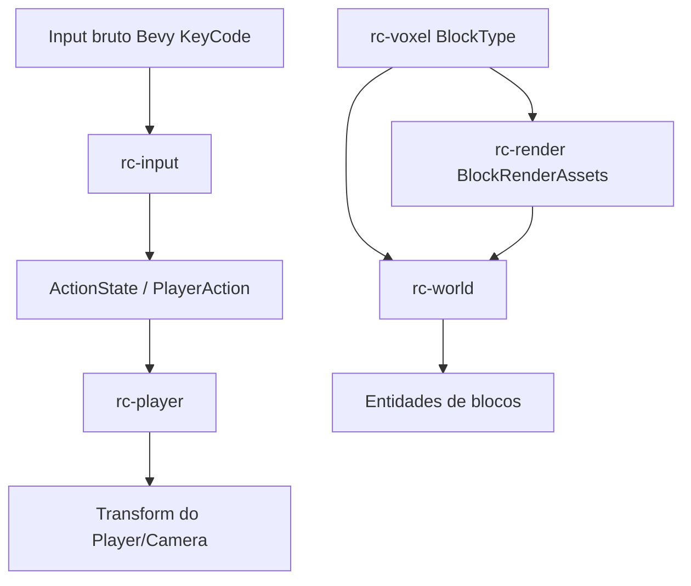

# Arquitetura do rustcraft

Este documento registra a separação atual de responsabilidades do `rustcraft` e a direção técnica para evoluir o protótipo voxel sem transformar tudo em um único `main.rs`.

## Objetivo da separação

A arquitetura atual ainda é pequena, mas já cria fronteiras para os sistemas que tendem a crescer:

- input e controles;
- ações/intents de gameplay;
- player/câmera;
- geração e dados de mundo;
- blocos;
- renderização;
- configuração;
- UI/debug tools.

A prioridade é manter o código simples, mas com fronteiras reais de Cargo workspace para exercitar packages/crates, APIs públicas e dependências sem ciclos.

## Fluxo de runtime



## Packages do workspace

| Package | Responsabilidade atual | Não deve assumir |
| --- | --- | --- |
| `rustcraft` | Bin/app principal: `DefaultPlugins`, `RustcraftPlugin` e composição dos plugins internos. | Regras de gameplay, dados voxel, render assets ou input físico. |
| `rc-input` | `PlayerAction`, `ActionState`, bindings teclado → ação e `InputPlugin`. | Mover player, gerar mundo ou conhecer render. |
| `rc-player` | `Player`, `PlayerConfig`, spawn da câmera/player e movimento por ações. | Ler `KeyCode` diretamente, gerar terreno ou criar materiais. |
| `rc-voxel` | `BlockType` e regras puras de bloco. | Depender de Bevy, meshes, materials, input ou player. |
| `rc-render` | `RenderConfig`, iluminação, mesh/material compartilhados e `BlockRenderAssets`. | Gerar topologia do mundo ou mapear controles. |
| `rc-world` | `WorldConfig`, `Block`, geração inicial e spawn dos blocos. | Mapear teclas, mover player ou decidir materiais. |

## Ordem dos sistemas

As crates que precisam de ordenação exportam seus próprios sets. A dependência relevante hoje é:

```text
rc-render::RenderStartupSet::PrepareAssets
    -> rc-world::spawn_initial_chunk
```

Isso garante que `rc-world` só use `BlockRenderAssets` depois que `rc-render` criou os handles de mesh/material.

Em runtime:

```text
PreUpdate / rc-input::InputSet::CollectInput
    ↓
Update / rc-player::move_player
```

O input é coletado em `PreUpdate`; o movimento consome `ActionState` em `Update`.

## Decisões atuais

### Bevy continua sendo o runtime principal

O projeto segue com Bevy porque o objetivo imediato é estudar ECS, plugins, renderização 3D, assets e sistemas de gameplay sem construir engine do zero.

### Workspace multi-crate didático

A estrutura agora implementa a ADR-0003 registrada no vault:

```text
crates/rustcraft   # bin/app principal
crates/rc-input    # input bruto -> ações semânticas
crates/rc-player   # player/câmera/controlador
crates/rc-voxel    # dados voxel puros
crates/rc-render   # luz, materiais, meshes, render plugin
crates/rc-world    # geração/spawn inicial do mundo
```

O grafo intencional é:

```text
rustcraft
├── rc-input
├── rc-player ──→ rc-input
├── rc-voxel
├── rc-render ──→ rc-voxel
└── rc-world  ──→ rc-voxel, rc-render
```

`rc-voxel` fica sem dependência de Bevy para manter a fronteira de domínio mais pura.

### Input bruto não move gameplay diretamente

`rc-input` traduz `KeyCode` para `PlayerAction`. `rc-player` consome `ActionState`. Essa separação facilita:

- remapeamento de teclas;
- suporte a gamepad;
- playback/replay;
- input de rede no futuro;
- testes de gameplay sem simular teclado.

### Bloco lógico é separado de render

`rc-voxel` define `BlockType`; `rc-render` decide qual material representa cada tipo. Isso prepara o caminho para:

- textura/atlas;
- meshing por chunk;
- blocos com propriedades físicas;
- blocos invisíveis/técnicos;
- serialização de mundo sem carregar assets gráficos.

## Limitações conhecidas

A implementação atual ainda usa uma entidade renderizável por bloco. Isso é simples para estudo, mas não escala.

A próxima etapa técnica importante é substituir isso por:

1. estrutura de chunk em memória;
2. armazenamento compacto de blocos;
3. geração de mesh por chunk;
4. emissão apenas de faces expostas;
5. atualização parcial de chunks alterados;
6. colliders por chunk, não por bloco individual.

## Próximas fronteiras recomendadas

1. Criar `Chunk`, `ChunkCoord` e armazenamento de blocos sem depender de entidades Bevy por bloco.
2. Criar um `chunk_meshing` separado para gerar `Mesh` a partir dos dados de chunk.
3. Mudar `rc-world` para spawnar uma entidade por chunk mesh.
4. Adicionar raycast/interação de bloco.
5. Integrar Rapier com collider por chunk.
6. Adicionar `menu`/debug overlay para render distance, wireframe/diagnósticos e posição do player.
