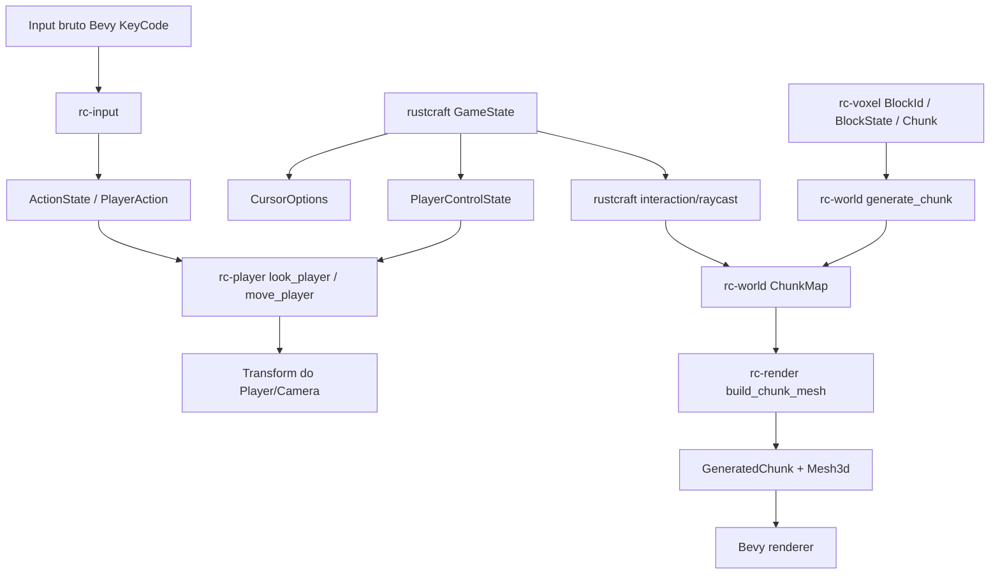

# Arquitetura do rustcraft

Este documento registra a separação atual de responsabilidades do `rustcraft` e a direção técnica para evoluir o protótipo voxel sem transformar tudo em um único `main.rs`.

## Objetivo da separação

A arquitetura atual ainda é pequena, mas já cria fronteiras para os sistemas que tendem a crescer:

- input e controles;
- ações/intents de gameplay;
- player/câmera;
- geração e dados de mundo;
- blocos;
- renderização;
- configuração;
- UI/debug tools.

A prioridade é manter o código simples, mas com fronteiras reais de Cargo workspace para exercitar packages/crates, APIs públicas e dependências sem ciclos.

## Fluxo de runtime



## Packages do workspace

| Package | Responsabilidade atual | Não deve assumir |
| --- | --- | --- |
| `rustcraft` | Bin/app principal: `DefaultPlugins`, `RustcraftPlugin`, `GameState`, pausa/cursor e composição dos plugins internos. | Dados voxel, render assets ou input físico. |
| `rc-input` | `PlayerAction`, `ActionState`, bindings teclado → ação e `InputPlugin`. | Mover player, gerar mundo ou conhecer render. |
| `rc-player` | `Player`, `PlayerConfig`, `PlayerControlState`, spawn da câmera/player, mouse look e movimento por ações. | Ler `KeyCode` diretamente, conhecer `GameState`, gerar terreno ou criar materiais. |
| `rc-voxel` | Dados voxel puros: `BlockId`, `BlockState`, definições/registry, posições e `Chunk`. | Depender de Bevy, meshes, materials, input ou player. |
| `rc-render` | `RenderConfig`, iluminação, materiais, assets visuais e conversão de `Chunk` em mesh Bevy. | Gerar terreno, possuir estado de mundo ou mapear controles. |
| `rc-world` | `WorldConfig`, seed, geração de chunk, `ChunkMap`, spawn da entidade renderizável, dirty/remesh e diagnósticos de mundo. | Mapear teclas, mover player ou decidir detalhes visuais internos do render. |

## Ordem dos sistemas

As crates que precisam de ordenação exportam seus próprios sets. A dependência relevante hoje é:

```text
rc-render::RenderStartupSet::PrepareAssets
    -> rc-world::spawn_initial_chunk
```

Isso garante que `rc-world` só use `BlockRenderAssets` depois que `rc-render` criou os handles de mesh/material.

Em runtime:

```text
PreUpdate / rc-input::InputSet::CollectInput
    ↓
Update / rustcraft::toggle_pause
    ↓
Update / rc-player::look_player -> rc-player::move_player
    ↓
PostUpdate / rustcraft::interaction -> rc-world::rebuild_dirty_chunks
```

O input é coletado em `PreUpdate`; `GameState` alterna `InGame`/`Paused`; `PlayerControlState` habilita ou desabilita `look_player`/`move_player`; e a interação com bloco só roda enquanto o jogo está em `InGame`.

## Decisões atuais

### Bevy continua sendo o runtime principal

O projeto segue com Bevy porque o objetivo imediato é estudar ECS, plugins, renderização 3D, assets e sistemas de gameplay sem construir engine do zero.

### Workspace multi-crate didático

A estrutura agora implementa a ADR-0003 registrada no vault:

```text
crates/rustcraft   # bin/app principal
crates/rc-input    # input bruto -> ações semânticas
crates/rc-player   # player/câmera/controlador
crates/rc-voxel    # dados voxel puros
crates/rc-render   # luz, materiais, meshes, render plugin
crates/rc-world    # geração/spawn inicial do mundo
```

O grafo intencional é:

```text
rustcraft
├── rc-input
├── rc-player ──→ rc-input
├── rc-voxel
├── rc-render ──→ rc-voxel
└── rc-world  ──→ rc-voxel, rc-render
```

`rc-voxel` fica sem dependência de Bevy para manter a fronteira de domínio mais pura.

### Input bruto não move gameplay diretamente

`rc-input` traduz `KeyCode` para `PlayerAction`. `rc-player` consome `ActionState`. Essa separação facilita:

- remapeamento de teclas;
- suporte a gamepad;
- playback/replay;
- input de rede no futuro;
- testes de gameplay sem simular teclado.

### Estado de jogo e controle do player são separados

`rustcraft::GameState` representa o modo do app, como `InGame` e `Paused`. Ele controla captura/liberação do cursor e quais sistemas de app podem rodar.

`rc-player::PlayerControlState` representa apenas se o controlador do player está aceitando look/movimento. Essa separação evita acoplar `rc-player` ao app principal e deixa espaço para casos futuros como inventário, cutscene, morte, debug camera ou menu sem tratar todos como o mesmo estado de jogo.

### Camera livre manual é intencional por enquanto

Bevy `0.18.1` oferece `FreeCamera`/`FreeCameraPlugin` pela feature opcional `free_camera`. O projeto mantém `rc-player` manual neste momento porque o objetivo didático é aprender input, sistemas e `Transform`, além de preservar a separação `rc-input` → `ActionState` → `rc-player`.

Essa decisão pode ser reavaliada se a câmera virar apenas ferramenta de debug. Para gameplay próprio, o controlador manual continua sendo o caminho mais flexível.

### Bloco lógico é separado de render

`rc-voxel` define `BlockId`, `BlockState` e metadados de bloco; `rc-render` decide como transformar esses dados em mesh, material e atributos visuais como vertex colors. Isso prepara o caminho para:

- textura/atlas;
- meshing por chunk;
- blocos com propriedades físicas;
- blocos invisíveis/técnicos;
- serialização de mundo sem carregar assets gráficos.

## Limitações conhecidas

O spawn principal já usa uma entidade renderizável para o chunk inicial, gerada a partir de `Chunk` + mesh com faces expostas.

O projeto já tem `Chunk` em memória, `ChunkMap`, geração de mesh por chunk com faces expostas, vertex colors por tipo de bloco, spawn inicial por chunk, quebra/colocação mínima de bloco por raycast e rebuild de mesh para chunks dirty. As próximas etapas técnicas importantes são:

1. evoluir de vertex colors para atlas de textura, array texture ou abordagem equivalente;
2. introduzir inventário/seleção de bloco para substituir o bloco fixo usado na colocação mínima;
3. colliders por chunk, não por bloco individual;
4. consulta de chunks vizinhos para remover faces internas entre chunks.

## Próximas fronteiras recomendadas

1. Evoluir vertex colors para atlas de textura ou array texture sem voltar ao spawn por bloco.
2. Criar UI mínima de pausa/menu sem misturar estado do app com estado do player.
3. Evoluir a interação de bloco para inventário, seleção de bloco e estado persistente de bloco mirado.
4. Medir tempo de meshing quando chunk map/streaming existir.
5. Integrar Rapier com collider por chunk.
6. Consultar chunks vizinhos no meshing para evitar faces internas entre chunks.
7. Adicionar `menu`/debug overlay para render distance, wireframe/diagnósticos e posição do player.
